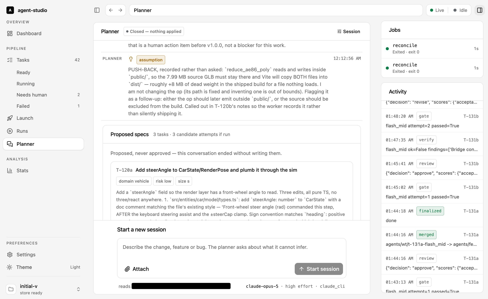

# agent-studio-ui

Control panel for the [agent-studio](https://github.com/NorthernPlatanus/agent-studio)
orchestrator: talk to the planner, watch the task pipeline, supervise running jobs, read the
token/cost statistics.

<picture>
  <source media="(prefers-color-scheme: dark)" srcset=".github/assets/planner-dark.jpg">
  
</picture>

<sup>A planner session that ended without writing its specs. The shot follows your GitHub theme —
the app ships both.</sup>

## What you get

- **Planner** — a conversation that ends in task specs rather than prose. Questions, decisions
  and assumptions are separate frame kinds, so what the model decided on its own is visible
  without rereading the thread.
- **Pipeline** — tasks by state (ready, running, done, needs human, failed), the launch queue,
  and runs down to their individual stages and candidates.
- **Live** — one `EventSource` per project feeds the jobs list and the activity rail. The
  stream carries invalidations, not rows: it tells the cache what went stale and the queries
  refetch, so a reconnect can never leave the screen holding data nobody else can see.
- **Stats** — usage grouped by role, model, provider or day, each row split by billing channel
  and carrying its own cache-hit rate, plus solve rate per candidate model.

## Requirements

Node 22+, npm 10+. The orchestrator's FastAPI layer supplies the data (`orchestrator serve`,
port 8787 by convention).

## Setup

```bash
npm install
cp .env.example .env   # then edit VITE_API_BASE if the API is not on 127.0.0.1:8787
npm run dev            # http://localhost:5173
```

## Scripts

| Script | What it does |
|---|---|
| `npm run dev` | Vite dev server on port 5173 |
| `npm run build` | typecheck, then production build into `dist/` |
| `npm run preview` | serve the built `dist/` |
| `npm test` | Vitest run (Testing Library + MSW) |
| `npm run lint` | `biome check` — formatting, lint, FSD import boundaries |
| `npm run lint:fix` | the same, applying safe fixes |
| `npm run typecheck` | `tsc --noEmit` over the app and the Vite config |
| `npm run api:types` | regenerate `src/shared/api/generated.ts` from the live OpenAPI schema |
| `npm run api:check` | regenerate and fail if the committed types drift |

`api:types` and `api:check` need a running API: they read `$VITE_API_BASE/openapi.json`
(default `http://127.0.0.1:8787`).

## Architecture

Feature-Sliced Design. Imports go **down** only — `app → pages → widgets → features → entities
→ shared` — never upward and never sideways between slices of the same layer. Same-slice
imports are relative (`./thing`); cross-slice imports use the `@/` alias. Biome enforces this
with per-layer `noRestrictedImports` overrides, so a misplaced file fails `npm run lint`.

```
src/
  app/       providers (query, theme), router, layout, global styles
  pages/     dashboard · tasks · task-detail · runs · run-detail · planner · stats · settings
  widgets/   composed panels (queue board, stage pipeline, candidate board, charts, consoles)
  features/  user actions (start run, stop job, filters, project switch, theme toggle)
  entities/  task · run · candidate · usage · event · job · project — api/ + model/ + ui/
  shared/    api client + SSE + generated types, shadcn/ui primitives, lib, config, store
```

Two state rules that keep the libraries from fighting:

- **All server state lives in TanStack Query**, keyed project-first (`[entity, project, …]`) so
  switching projects can never surface another project's cache.
- **Zustand holds UI state only** — selection, filters, layout, stream status. No server data.

Server types are **generated, never handwritten** (`npm run api:types`) and committed, so
contract drift shows up as a diff rather than a runtime surprise.

## License

MIT — see [LICENSE](LICENSE).
